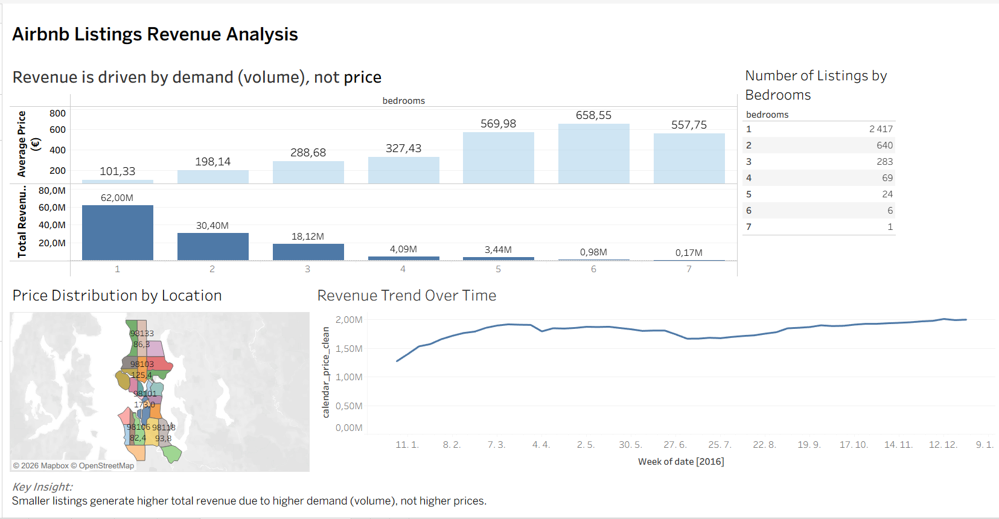

# Airbnb Revenue Analysis Dashboard

This project presents a Tableau dashboard analyzing Airbnb listings, pricing, and revenue patterns.

## Dashboard Preview

## Key Insights

- Revenue is driven more by demand (number of listings) than price.
- Listings with more bedrooms tend to generate higher average revenue.
- Revenue shows a stable upward trend over time.
- Geographic distribution highlights high-performing locations.

## Tools Used

- Tableau
- Data Visualization
- Exploratory Data Analysis (EDA)
